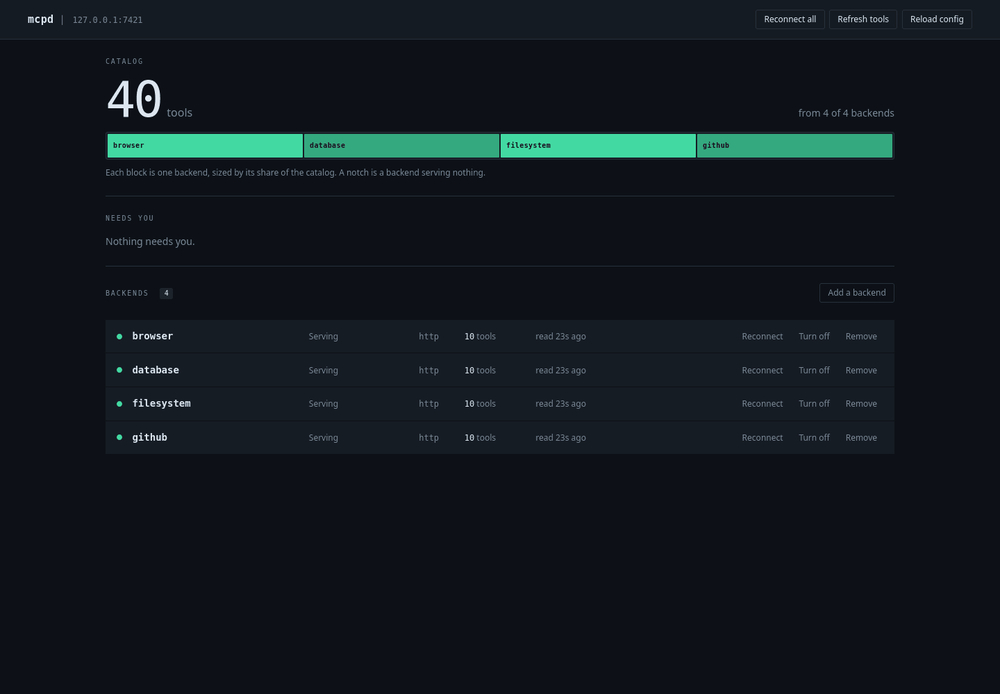
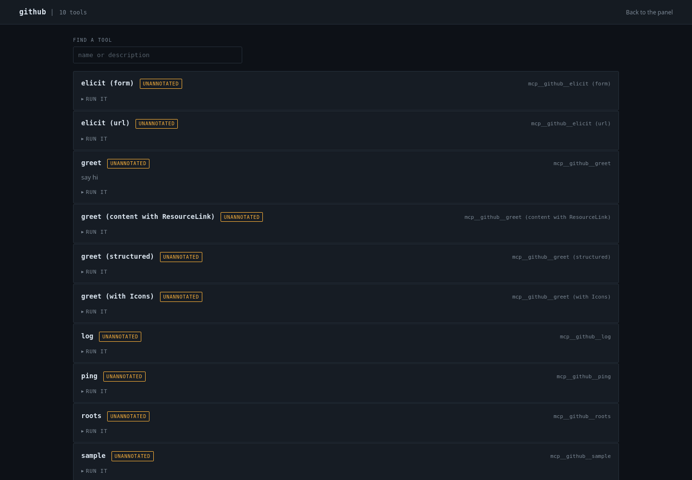

<p align="center">
  
</p>

<h1 align="center">mcpd</h1>

<p align="center"><em>One local MCP daemon for every coding agent.</em></p>

<p align="center">
  <a href="https://github.com/ahodges22/mcpd/actions/workflows/ci.yml"></a>
  <a href="https://github.com/ahodges22/mcpd/releases"></a>
  
</p>

`mcpd` fronts all of your MCP backends with one loopback-only daemon. It gives clients the tool surface that fits them, manages OAuth-backed servers, and shows backend health and tools in a local web panel.



## What it does

- Declares each stdio or Streamable HTTP backend once.
- Serves the full tool catalog to clients that have native tool search.
- Serves a three-tool search facade to clients that would otherwise load every schema.
- Keeps OAuth grants, health state, and the tool catalog in one local daemon.
- Provides a status panel, backend controls, and a searchable tool inspector.
- Rewires supported clients with a dry-run-first, reversible command.

| Client | Endpoint | Tool surface |
|---|---|---|
| Claude Code | `/mcp/passthrough` | Full catalog for native tool search |
| Codex | `/mcp/passthrough` | Full catalog for native tool search |
| Cursor | `/mcp/search` | `search_tools`, `describe_tool`, and `call_tool` |
| OpenCode | `/mcp/search` | `search_tools`, `describe_tool`, and `call_tool` |

The facade reduces schema load, but it also moves argument validation and approval granularity behind one `call_tool`. Use pass-through when the client can search tools itself.

## Install

Release archives contain one self-contained binary. The web UI is embedded.

| Platform | Archive |
|---|---|
| Linux x86-64 | [`mcpd_linux_amd64.tar.gz`](https://github.com/ahodges22/mcpd/releases/latest/download/mcpd_linux_amd64.tar.gz) |
| Linux ARM64 | [`mcpd_linux_arm64.tar.gz`](https://github.com/ahodges22/mcpd/releases/latest/download/mcpd_linux_arm64.tar.gz) |
| macOS Intel | [`mcpd_darwin_amd64.tar.gz`](https://github.com/ahodges22/mcpd/releases/latest/download/mcpd_darwin_amd64.tar.gz) |
| macOS Apple silicon | [`mcpd_darwin_arm64.tar.gz`](https://github.com/ahodges22/mcpd/releases/latest/download/mcpd_darwin_arm64.tar.gz) |

Extract the archive and put `mcpd` on your `PATH`:

```sh
mkdir -p "$HOME/.local/bin"
tar -xzf mcpd_*_*.tar.gz
install -m 0755 mcpd "$HOME/.local/bin/mcpd"
```

Each release also publishes `checksums.txt`. Verify the downloaded archive before you extract it:

```sh
sha256sum --check --ignore-missing checksums.txt
```

On macOS, select the archive you downloaded because `shasum` has no `--ignore-missing` option:

```sh
archive=mcpd_darwin_arm64.tar.gz
grep " $archive$" checksums.txt | shasum -a 256 -c -
```

To build from source instead:

```sh
go install github.com/ahodges22/mcpd/cmd/mcpd@latest
```

This requires Go 1.26.5 or later.

## Quick start

Create an empty declaration, start the daemon, and open <http://127.0.0.1:7420>:

```sh
install -d -m 0700 "$HOME/.config/mcpd"
printf '{"backends":{}}\n' > "$HOME/.config/mcpd/config.json"
mcpd
```

Add stdio and HTTP backends from the panel, or edit `~/.config/mcpd/config.json`. A minimal stdio declaration looks like this:

```json
{
  "backends": {
    "example": {
      "command": "/absolute/path/to/mcp-server",
      "args": ["--stdio"],
      "env_passthrough": ["EXAMPLE_TOKEN"]
    }
  }
}
```

For an HTTP backend, use `http_url` instead of `command`. Header values can reference daemon environment variables as `${VAR}`. Set `"auth": "oauth"` when the server supports OAuth discovery and a loopback redirect.

The daemon reloads declarations through the panel. Panel add and remove actions also update the declaration file with an atomic swap and retain displaced versions beside that file.

## Connect clients

Inspect the proposed edits first:

```sh
mcpd install --client all
```

Apply them after you review the output:

```sh
mcpd install --client all --apply
```

Restart each client after the change. To remove mcpd and restore the declarations it displaced:

```sh
mcpd install --client all --revert --apply
```

The installer supports `claude`, `codex`, `cursor`, `opencode`, or `all`. It records a receipt in the mcpd state directory and refuses a revert when a region it owns has changed.

For login-session startup on Linux or macOS, see [the systemd and launchd guide](dist/README.md).

## Inspect tools

Select a backend in the panel to filter its tools, inspect input schemas, see safety annotations, and invoke a tool directly.



## How it works

```text
Claude Code ─┐
Codex ───────┴── /mcp/passthrough ─┐
                                     ├── catalog ── sessions ── MCP backends
Cursor ──────┬── /mcp/search ───────┘       │
OpenCode ────┘                              ├── OAuth grant store
                                            └── status and tool inspector
```

`tools/call` is at most once. mcpd reconnects only when no send was attempted, because a failed write does not prove that an upstream mutation did not run. Stdio children receive a constructed environment instead of inheriting every credential held by the daemon.

The implementation design and acceptance scenarios are in [`openspec/changes/mcpd-v1`](openspec/changes/mcpd-v1/).

## Security model

- mcpd listens on loopback and has no user authentication. Any process running as the same user can call every connected tool.
- A stdio backend runs as the same user. Its declared environment is least privilege, but the process is not sandboxed.
- Host and browser-origin checks protect the web and MCP routes from cross-site requests and DNS rebinding.
- OAuth grants and runtime state live under `~/.local/state/mcpd/`. Protect that directory as user-private data.
- State-changing web actions use guarded JSON `POST` requests. Backend-provided text is escaped before it reaches the page.

Do not expose the listener to a network interface. mcpd is a local trust-boundary tool, not a multi-user MCP gateway.

## Develop

```sh
go test -count=1 -race ./...
go build ./cmd/mcpd
```

CI runs the full suite on Linux and macOS. It also builds a GoReleaser snapshot for Linux and macOS on amd64 and arm64.

## Release

Push an annotated semantic-version tag:

```sh
git tag -a v0.1.0 -m v0.1.0
git push origin v0.1.0
```

The release workflow runs the Linux and macOS test suites, then publishes the four archives, SHA-256 checksums, and generated release notes to a GitHub Release.
